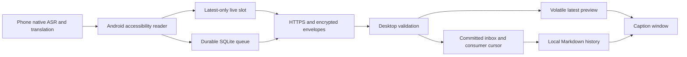

# Caption Relay

 · [MIT license](LICENSE)

**Read your compatible Xiaomi phone's live bilingual captions on a Windows screen, and keep a local text history.**

[English](#english) · [简体中文](#简体中文) · [Setup](docs/SETUP.md) · [Workflow](docs/WORKFLOW_AND_CHECKPOINTS.md) · [Troubleshooting](docs/TROUBLESHOOTING.md)

## English

Use Caption Relay when your Xiaomi phone already shows original and translated captions during a supported call or video, but you want a larger window on your PC and a text record to revisit afterward. The phone performs speech recognition and translation; this project brings the resulting text to Windows.

### When to use it

- **Follow a conversation on a larger screen:** read the phone's original and translated lines in a Windows caption window.
- **Revisit text after the session:** keep local Markdown history without making this bridge an audio recorder.
- **Recover from a connection interruption:** retain captured history in a phone queue while an independent channel keeps the newest preview moving.

| You provide | You get |
| --- | --- |
| A compatible Xiaomi phone already displaying bilingual captions | Original and translated lines in a Windows window |
| A paired Android sender and a running Windows receiver | A live preview plus a separate, recoverable local text history |
| Non-sensitive test speech supported by the phone | A way to verify the complete phone-to-window-to-history path |

**Illustrative result, using invented text:** the phone displays `What time does the meeting start?` and `会议几点开始？`; the Windows window shows those lines and the local history retains the captured text. Observation timestamps describe when captions were seen, not word positions in a recording.

### Real platforms and tools used

| Platform or tool | Its role in this project |
| --- | --- |
| **Xiaomi native bilingual captions / call translation** | The actual text source. The [Android reader](app/mobile_caption/android/src/org/captionrelay/bridge/CaptionAccessibilityService.java) currently targets `com.xiaomi.aiasst.vision` and specific caption nodes. |
| **Android Accessibility Service** | Reads the caption UI and sends its text. It does not enable the phone's recognition feature. |
| **Windows x64, Python and Tkinter** | Runs the receiver, larger caption window and local Markdown history. |
| **Cloudflare Quick Tunnel / cloudflared** | Provides the temporary HTTPS route used by the included controller when the phone sends to the PC over the Internet. |
| **Android SDK, ADB and JDK 21** | Builds the Android sender and supports owner-controlled USB setup and pairing. |
| **Codex** | Was used to develop and operate this workflow. The optional [operator skill](skills/caption-relay/SKILL.md) guides a coding assistant; it does not automatically paste or send captions to a Codex chat. |

These names explain the implementation and deployment context; they do not imply affiliation. Caption Relay does not record audio, include an ASR model, call an LLM or send messages to another application.

The Android reader currently targets Xiaomi caption packages and accessibility nodes. The desktop application targets Windows x64. Android API 26 is the installation minimum, **not a promise that every API 26+ device exposes compatible bilingual captions**. There is no complete iOS implementation.

### What it does

- Reads source and translated text by their UI roles, without guessing the language.
- Sends the newest preview on a separate latest-only channel, so old queued history does not block current text.
- Stores a reliable Android queue and acknowledges durable batches only after the desktop has validated and committed them.
- Uses HTTPS, AES-256-GCM, a private bearer token, and authenticated acknowledgements.
- Displays captions in a desktop window and writes local Markdown history.
- Provides explicit start, stop, private pairing, PC migration, build, and synthetic test commands.

### Start here

This repository contains source, tests, and build instructions. It does not ship credentials, private conversation examples, production databases, signed APKs, or a ready-made installer.

1. Start with the [phone compatibility check](docs/SETUP.md#1-check-the-phone-before-building-anything): confirm that native original and translated captions actually appear and are accessible.
2. Install Python 3.11 x64, JDK 21, and Android SDK platform/build-tools 36.
3. Follow [Setup](docs/SETUP.md) **in order**: dependencies → Python/JVM tests → new-install signing → APK → permissions → local preview → private pairing → desktop start → fresh real captions.
4. Use [Troubleshooting](docs/TROUBLESHOOTING.md) if any checkpoint fails.
5. Read [Migration and upgrades](docs/MIGRATION_AND_UPGRADES.md) before moving PCs or updating an installed app.

For the complete component-to-component sequence, read [End-to-end workflow and checkpoints](docs/WORKFLOW_AND_CHECKPOINTS.md). The optional [Caption Relay operator skill](skills/caption-relay/SKILL.md) lets a coding assistant follow the same verified order; it is an instruction file, not an ASR engine or an automatic chat sender.

A process, an HTTP response, a test caption, or old Markdown history does not establish a working real caption session. Acceptance requires a new authenticated phone packet and fresh source/translated text that reaches both the window and reliable history. The public namespace must be accepted on your own device; synthetic tests do not replace that step.

### Architecture

See [Architecture](docs/ARCHITECTURE.md) for sequence handling, acknowledgements, retries, and storage boundaries.

Read the [core code guide](docs/CORE_CODE.md) for the capture, latest-slot, authenticated ACK, transaction and recovery entry points.

### Repository map

| Path | Purpose |
| --- | --- |
| `app/` | Python receiver, collector, window, controller, and tests |
| `app/mobile_caption/android/` | Native Java Android sender, resources, manual SDK build, and JVM tests |
| `app/device/` | Optional USB caption reader |
| `app/mobile_caption/desktop/` | Windows manager and portable build sources |
| [`history/`](history/README.md) | Sanitized earlier source snapshots; reference only |
| `tools/` | Source export and publication checks |
| [`skills/caption-relay/`](skills/caption-relay/SKILL.md) | Project-specific operator instructions |
| `docs/` | Setup, troubleshooting, architecture, upgrades, and documentation references |

### Limitations and privacy

- Accessibility visibility depends on the phone, OS build, subtitle UI, and permissions. Unsupported node layouts need an adapter and device-level tests.
- Live preview is replaceable and volatile. Reliable history is a separate channel; neither can reconstruct words the native feature never displayed or the reader never observed.
- SQLite, Markdown, private pairing files, and migration archives contain sensitive local data. They are **not encrypted at rest** by this project.
- The included tunnel controller uses temporary Cloudflare Quick Tunnels for development. Hostnames change after recreation; there is no uptime guarantee. See [Cloudflare's Quick Tunnel documentation](https://developers.cloudflare.com/tunnel/get-started/quick-tunnels/).
- Request RTT, UI polling intervals, and synthetic tests are not end-to-end speech-to-window latency measurements. There is no millisecond delivery promise.
- The development APK is debuggable for owner-controlled USB pairing. It is not presented as an app-store hardened release.
- There is no OTA update system, automatic GPT/Codex message sender, or automatic merge into another master conversation record.

### Choose the right project

The repositories below have different inputs. Links are navigation, not a claim that an automatic cross-project integration already exists.

| Your task | Project |
| --- | --- |
| Show compatible phone captions on a PC | **Caption Relay — this repository** |
| Transcribe an existing audio/video file | [Polyglot Media Workbench](https://github.com/KietC/polyglot-media-workbench) |
| Save and review a specified OKKI customer record | [CRM Evidence Workbench](https://github.com/KietC/crm-evidence-workbench) |
| Archive records from an adapted website or research public market leads | [Local Evidence Collector](https://github.com/KietC/local-evidence-collector) |
| Organize a trade-show exhibitor directory | [Exhibitor Research Archive](https://github.com/KietC/exhibitor-research-archive) |
| Investigate who manufactures a product | [FactoryTrace](https://github.com/KietC/factorytrace) |

Use the media workbench for audio-based transcripts with audio start/end positions. Caption Relay's UI observation timestamps are a different kind of record and cannot replace an audio timeline.

### Development and contribution

Use the isolated tests in [Setup](docs/SETUP.md) before editing transport or migration code. Changes to sequence domains, encryption AAD, acknowledgements, queue deletion, or pairing must keep corresponding regression tests. Current `app/` comments are maintained in English and Chinese. [Historical snapshots](history/README.md) are unmaintained reference code and may retain single-language comments; they are not the current build or configuration guide. Use synthetic text in issues and pull requests. Never attach your pairing code, signing key, database, conversation history, private tunnel URL, or raw diagnostic archive.

The project is licensed under [MIT](LICENSE). Dependencies and external tools retain their own licenses; see [NOTICE.md](NOTICE.md). See [Contributing](CONTRIBUTING.md) and [Security](SECURITY.md) before sharing reports. The [high-star README research](docs/README_RESEARCH.md) records the inspected projects and formatting criteria; [Documentation design](docs/README_DESIGN.md) maps those choices to these guides and official tool references. No third-party implementation is implied by those references.

---

## 简体中文

**把兼容小米手机正在显示的双语字幕放到 Windows 大屏上看，并保存本地文字记录。**

手机在支持的通话或视频中已经显示原文和译文，但你想在电脑看得更清楚、结束后还能回顾文字，就可以使用 Caption Relay。语音识别和翻译由手机原生功能完成，本项目把结果传到 Windows。

### 适合什么场景

- **边交流边看大屏：**在 Windows 字幕窗口阅读手机的原文和译文。
- **结束后回顾文字：**保存本地 Markdown 历史；桥接程序本身不录音。
- **连接中断后补回记录：**已采集的历史在手机排队保存，最新预览走独立通道。

| 你准备什么 | 最后得到什么 |
| --- | --- |
| 已能显示双语字幕的兼容小米手机 | Windows 窗口中的原文和译文 |
| 已配对的 Android 发送端与正在运行的 Windows 接收端 | 即时预览及另一条可恢复的本地文字历史 |
| 手机原生功能支持的不敏感测试讲话 | 核对“手机 → 电脑窗口 → 历史记录”是否完整打通 |

**虚构示例：**手机显示 `What time does the meeting start?` 和 `会议几点开始？`，电脑窗口同步显示这两行，本地历史保留采集到的文字。记录中的观察时间表示何时看到字幕，不是录音里每个词的起止时间。

### 实际用到了哪些平台和工具

| 平台或工具 | 在本项目中的作用 |
| --- | --- |
| **小米原生双语字幕 / 通话翻译** | 真正的文字来源。[Android 读取器](app/mobile_caption/android/src/org/captionrelay/bridge/CaptionAccessibilityService.java)当前针对 `com.xiaomi.aiasst.vision` 及指定字幕节点。 |
| **Android 无障碍服务** | 读取字幕界面并发送文字，不替手机开启识别功能。 |
| **Windows x64、Python、Tkinter** | 运行接收器、大屏字幕窗口和本地 Markdown 历史。 |
| **Cloudflare Quick Tunnel / cloudflared** | 手机通过互联网向电脑发送时，内置控制器使用的临时 HTTPS 通道。 |
| **Android SDK、ADB、JDK 21** | 构建手机发送端，支持本人控制的 USB 设置与配对。 |
| **Codex** | 用于开发和操作这套流程。可选的[操作 skill](skills/caption-relay/SKILL.md)指引编码助手，不会自动把字幕粘贴或发送到 Codex 聊天。 |

这些名称用于说明实现和部署环境，不表示合作或隶属关系。本项目不录音、不内置 ASR 模型、不调用大模型，也不向其他应用发送消息。

当前 Android 读取器针对小米字幕包名与无障碍节点，桌面端针对 Windows x64。Android API 26 只是安装最低版本，**不代表所有 Android 8.0 及以上手机都能提供兼容双语字幕**。本项目没有完整 iOS 实现。

### 功能

- 按界面的原文、译文角色读取文字，不通过语言猜测角色。
- 最新字幕使用独立通道，可靠历史积压不会挡住当前预览。
- Android 先持久化排队，电脑整批校验并提交数据库后才确认可靠数据。
- 使用 HTTPS、AES-256-GCM、私密 Bearer token 和经过认证的确认信息。
- 提供桌面字幕窗口和本地 Markdown 历史。
- 提供明确的启动、停止、私密配对、电脑迁移、构建及合成测试命令。

### 从这里开始

仓库提供源码、测试及构建流程，不包含连接凭据、真实对话样例、生产数据库、已经签名的 APK 或现成安装包。

1. 先按[手机兼容性检查](docs/SETUP.md#1-check-the-phone-before-building-anything)确认手机自身原文和译文都能出现，而且无障碍能读取；详细中文步骤在该指南后半部分。
2. 准备 Python 3.11 x64、JDK 21、Android SDK platform/build-tools 36。
3. **按顺序**阅读[安装与配置](docs/SETUP.md)：依赖 → Python/JVM 测试 → 新安装签名 → APK → 权限 → 本地预览 → 私密配对 → 电脑启动 → 新的真实字幕验收。
4. 任一检查点失败，按[故障排查](docs/TROUBLESHOOTING.md)处理。
5. 换电脑或覆盖更新前，先读[迁移与升级](docs/MIGRATION_AND_UPGRADES.md)。

完整的组件交接顺序见[全流程与检查点](docs/WORKFLOW_AND_CHECKPOINTS.md)。可选的 [Caption Relay 操作 skill](skills/caption-relay/SKILL.md) 可让编码助手遵守同一验收顺序；它是指引文件，不是语音识别引擎，也不是自动聊天发送器。

进程存在、HTTP 有响应、测试字幕发送成功或者旧 Markdown 能打开，都不能证明真实字幕会话已通。必须收到本次启动后的新认证手机包，并且新的原文、译文同时进入窗口和可靠历史。公开包名仍需在自己的手机上完成验收，合成测试不能替代这一步。

### 目录与实现

| 路径 | 用途 |
| --- | --- |
| `app/` | Python 接收器、采集器、窗口、控制器及测试 |
| `app/mobile_caption/android/` | 原生 Java 手机发送端、资源、SDK 构建脚本及 JVM 测试 |
| `app/device/` | 可选 USB 字幕读取器 |
| `app/mobile_caption/desktop/` | Windows 管理器及便携版构建源码 |
| [`history/`](history/README.md) | 脱敏后的早期源码快照，仅供参考 |
| `tools/` | 源码导出与发布检查工具 |
| [`skills/caption-relay/`](skills/caption-relay/SKILL.md) | 本项目的操作指引 |
| `docs/` | 安装、排障、架构、升级及文档参考 |

数据经过“手机原生识别/翻译 → 无障碍读取 → 独立即时槽与耐久队列 → 加密 HTTPS → 电脑校验 → 窗口及 Markdown”。详细的序号、确认、重试与存储边界见[架构说明](docs/ARCHITECTURE.md)。

[核心代码指引](docs/CORE_CODE.md)按采集、最新槽、签名确认、事务及恢复列出源码入口。

### 限制与隐私

- 字幕节点是否可见取决于机型、系统、字幕界面和权限。其它布局需要新增适配及真机验证。
- 即时预览允许覆盖旧帧，并且断电后不会保留；可靠历史走另一条通道。原生功能没有显示、或者读取器没有看到的文字无法补回。
- SQLite、Markdown、配对文件及迁移包包含敏感本地数据，本项目**没有提供静态存储加密**。
- 内置控制器使用临时 Cloudflare Quick Tunnel，适合开发测试；重建后地址会变，没有持续在线保证。参见 [Cloudflare 官方说明](https://developers.cloudflare.com/tunnel/get-started/quick-tunnels/)。
- 请求 RTT、窗口轮询间隔及合成测试都不等于“讲话到电脑显示”的端到端延迟，不能承诺公网毫秒级瞬时送达。
- 开发 APK 为便于本人 USB 配对而开启 debuggable，不应当作完成加固的应用商店版本。
- 未实现 OTA、自动发送 GPT/Codex 消息或自动合并到另一本总对话记录。

### 六个项目怎么选

以下项目处理的输入不同。这里提供选用导航，不表示已经实现跨仓库自动连接。

| 你要做的事 | 选择的项目 |
| --- | --- |
| 把兼容手机的字幕显示在电脑上 | **Caption Relay：本仓库** |
| 转写现有录音或视频 | [Polyglot Media Workbench](https://github.com/KietC/polyglot-media-workbench) |
| 保存和复盘指定 OKKI 客户记录 | [CRM Evidence Workbench](https://github.com/KietC/crm-evidence-workbench) |
| 归档已适配网站的记录，或研究公开市场线索 | [Local Evidence Collector](https://github.com/KietC/local-evidence-collector) |
| 整理展会展商名单 | [Exhibitor Research Archive](https://github.com/KietC/exhibitor-research-archive) |
| 调查产品的实际制造方 | [FactoryTrace](https://github.com/KietC/factorytrace) |

需要根据原声生成带音频起止时间的转写时，选择音视频工作台。Caption Relay 记录的是屏幕字幕观察时间，不能替代录音时间轴。

### 开发与贡献

修改传输或迁移代码前，先运行[安装与配置](docs/SETUP.md)中的隔离测试。涉及序号域、AAD、确认、删队列或配对的改动，应保留对应回归测试。当前 `app/` 注释按中英文维护；[历史快照](history/README.md) 不再维护，可能保留单语注释，不能当作当前构建或配置指南。Issue 和 PR 只使用合成文字，不上传配对码、签名密钥、数据库、真实对话、私密隧道地址或原始诊断包。

本项目采用 [MIT](LICENSE) 许可证。依赖及外部工具保留各自许可证，见 [NOTICE.md](NOTICE.md)。公开报告前先阅读[贡献指南](CONTRIBUTING.md)及[安全说明](SECURITY.md)。[高星 README 研究](docs/README_RESEARCH.md)记录查看的项目及格式检查标准；[文档设计说明](docs/README_DESIGN.md)说明这些结构如何应用于操作指南，并列出官方工具来源。参考文档结构不代表使用了对应项目的实现。
