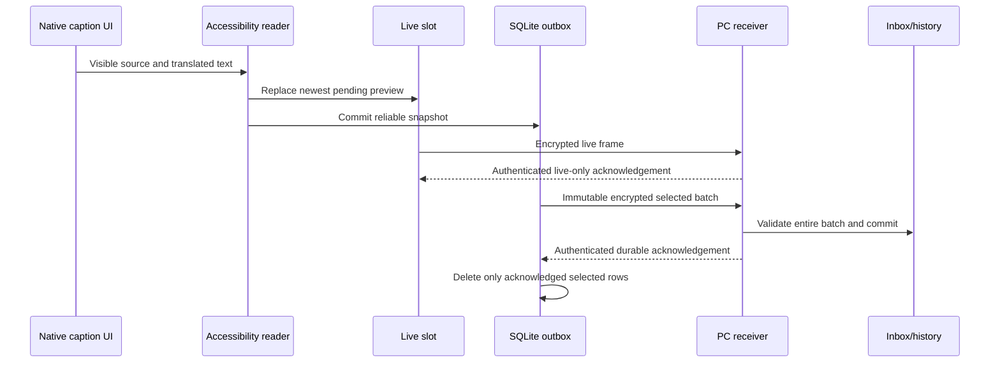

# Architecture / 架构

## English

### Responsibility boundaries

| Component | Responsibility | Does not establish |
| --- | --- | --- |
| Phone native captions | Speech recognition and translation already rendered on the phone | Complete or correctly translated speech |
| Accessibility reader | Select known caption packages/nodes and preserve source/translation roles | General OCR or arbitrary Android compatibility |
| Live sender | Deliver a replaceable current frame | Durable complete history |
| Durable sender | Store observed text and retry ordered data | Reconstruction of unseen text |
| Desktop receiver | Authenticate, validate, decrypt, and commit | Phone ASR accuracy |
| Collector/window | Consume inbox and render/persist captions | Automatic delivery to an AI conversation |
| Controller/manager | Start, stop, pair, and migrate owned processes/state | Permanent network availability |

### Capture → two delivery paths

The Android accessibility reader uses specific Xiaomi packages, resource IDs, and ancestor containers. It coalesces event bursts and has a fallback sampling loop. Source and translation are determined by their UI position, not text language. A source-only update is distinct from an actual bilingual update.

The same observed snapshot feeds two different paths:

1. **Live preview:** an in-memory latest slot. A newer frame replaces an unsent older one. Its worker and retry state are independent from reliable delivery. An old acknowledgement may clear only the exact selected live frame, never a newer frame or durable rows.
2. **Reliable history:** an app-private SQLite outbox using durable transactions. Continuous sequence numbers identify events. A bounded queue records explicit gaps when information cannot be retained; a gap is not secretly presented as recovered text.

### Encryption, sequences, and acknowledgements

The transport uses AES-256-GCM with a 12-byte nonce and bearer authorization. Live and durable messages use different authenticated-data/acknowledgement domains. A durable envelope is fixed before its first send and reused for retries; retrying must not create a different envelope for the same durable event.

The durable worker sends up to 100 records / 1 MiB per batch without waiting to fill the batch. The receiver validates schema, device/stream identity, sequence, envelope and nonce constraints for the whole selected batch, then commits to SQLite before returning its acknowledgement. The sender verifies acknowledgement identity and HMAC before deleting the corresponding immutable selection. Unsupported batch endpoints can fall back to the original single-record path.

An HTTP success code by itself is not permission to discard queued data. Live confirmation is never interpreted as confirmation that reliable history has been saved.

### Desktop consumption and crash recovery

The receiver and consumer are separate. Inbox rows can be committed before the window renders them. A per-session consumer cursor advances after history/latest/status output has been written. A crash before cursor advancement can therefore replay work rather than silently skip it. Atomic file replacement reduces partial visible JSON/Markdown writes; it is not a guarantee against every filesystem or disk failure.

Runtime files are generated locally under `app/mobile_caption/runtime/` and `app/output/`. They are excluded from the source release. The window combines saved reliable history with a volatile newest frame, and offers copying, scrolling, following, and pinning. Timestamp rendering uses fixed UTC+8 display without changing the host OS clock or timezone.

### Connectivity and lifecycle

The desktop receiver binds loopback at `127.0.0.1:18765`; the included controller starts a temporary HTTPS tunnel and saves the current endpoint. Phone and PC need not share a LAN. The phone needs the full `https://<host>/v1/captions` address. A new tunnel hostname requires a phone endpoint update.

Network/configuration changes release the relevant retry wait. Ordinary new captions do not cancel network backoff. Live and durable retry state are independent. The phone sender does not force every public request to close its connection; the local receiver still closes its own HTTP response. This does not prove that every tunnel/network route reuses connections.

Process ownership checks use identity and creation time. A port belonging to a different receiver is an error, not a reason to terminate arbitrary processes. Closing the manager window is not the same as stopping the receiver, window, tunnel, and phone sender.

### Latency vocabulary

| Measurement | Meaning | Main caveat |
| --- | --- | --- |
| Native ASR/translation delay | Speech to text appearing on the phone | Outside this transport |
| Queue residence | Enqueue to selected send/acknowledgement | Reliable backlog differs from live preview |
| Request RTT | Request start to response | Includes route/server; not speech-to-display |
| Receiver-to-consumer | Commit to consumer read | Excludes phone capture and network |
| Window polling | Time until next render check | Small configured waits are theoretical limits |
| End-to-end | Actual speech/visible-phone event to visible PC update | Requires a controlled live measurement |

Phone and PC wall-clock skew can make timestamp subtraction look slow or even negative. Use monotonic timing within a process and a synchronized, explicitly described cross-device measurement. Do not change OS time settings merely to improve a chart.

### Security and validation scope

The project transports text, not audio. HTTPS and encrypted envelopes protect network contents; local SQLite and Markdown remain plaintext. Pairing files and migration archives contain secrets and must remain private. The development Android app exposes a debuggable owner-pairing workflow; it is not a hardened store distribution.

Unit tests exercise protocol, acknowledgement, queue, preview, persistence, and migration properties with synthetic data. Java compilation checks source/API compatibility. Neither proves that a new phone exposes the expected nodes, that a permission survives an OS update, or that a public network meets a latency target. See [Setup](SETUP.md) for real-device acceptance.

---

## 简体中文

### 各模块负责什么

| 模块 | 职责 | 不能据此证明 |
| --- | --- | --- |
| 手机原生字幕 | 在手机上完成识别、翻译和显示 | 全部讲话都正确识别或翻译 |
| 无障碍读取器 | 按指定包、节点和容器读取原文/译文 | 通用 OCR 或任意 Android 兼容 |
| 即时发送器 | 发送允许覆盖的当前帧 | 完整耐久历史 |
| 可靠发送器 | 保存已观察到的文字并按序重试 | 补回从未看到的文字 |
| 电脑接收器 | 认证、校验、解密和提交 | 手机识别质量 |
| 消费器/窗口 | 消费收件库、显示及写历史 | 自动进入 AI 聊天 |
| 控制器/管理器 | 启停、配对、迁移自己拥有的进程及状态 | 网络永久在线 |

### 采集与双通道

Android 无障碍代码针对小米特定包名、资源 ID 和真实父容器；合并短时间内的事件，并有兜底采样。原文、译文按界面角色确定，不通过文字语言猜测。只有原文更新与真正双语更新是不同状态。

同一个观察到的字幕快照进入两条通道：

1. **即时预览：** 内存中的 latest 槽，新帧可以覆盖还没发出的旧帧。线程与重试独立于可靠历史。旧确认只能清除当时选中的同一帧，不能清除更新帧或耐久队列。
2. **可靠历史：** App 私有 SQLite 队列，以事务持久化和连续序号保存数据。队列容量有限，留不住时明确记录 gap；不会把丢失的数据伪装成已恢复字幕。

### 加密、序号与确认

传输使用 AES-256-GCM、12 字节 nonce 和 Bearer 认证。即时、可靠数据使用不同 AAD/确认域。耐久事件在第一次发送前固定加密 envelope，重试复用同一密文，不能同一事件每次重加密成不同内容。

可靠线程每批最多 100 条/1 MiB，不等待凑满。电脑校验整批 schema、设备/字幕流、序号、envelope 与 nonce，事务提交后才返回确认。手机验证身份及 HMAC 后，只删除当时不可变选择中已确认的行。旧端点不支持批量时可以退回单条路径。

HTTP 成功码本身不能作为删队列依据；即时确认也不能当作“可靠历史已保存”。

### 电脑消费及崩溃恢复

接收与消费分开运行：收件库可能先提交，窗口随后才显示。每会话消费游标在历史、latest、status 写完后推进；此前崩溃会重放，不应静默跳过数据。原子替换减少半写文件，但不能保证任何磁盘或文件系统故障下都无损。

运行资料生成在 `app/mobile_caption/runtime/` 和 `app/output/`，不属于公开源码。窗口把可靠历史与最新易失帧合并显示，支持复制、回看、跟随及置顶。时间只按 UTC+8 显示转换，不修改电脑系统时钟或时区。

### 连接与生命周期

电脑接收器监听 `127.0.0.1:18765`，内置控制器创建临时 HTTPS 隧道并保存地址，手机与电脑不必处于同一局域网。手机地址必须完整到 `https://<host>/v1/captions`；重建隧道后要更新手机。

网络或配置变化释放相应等待，新字幕本身不取消网络退避。即时与可靠重试独立。手机不再强制每次公网请求关闭连接，但本机接收器仍关闭自己的 HTTP 响应；不能因此保证任一路由都会复用连接。

进程归属按进程身份及创建时间检查。端口被别的接收器占用时应报错，不能随意结束其它程序。关闭管理器窗口不等于停止接收器、字幕窗口、隧道和手机发送器。

### 延迟应该怎样理解

| 指标 | 含义 | 边界 |
| --- | --- | --- |
| 原生识别/翻译 | 讲话到手机出现文字 | 不由本项目控制 |
| 队列停留 | 入队到选中发送/确认 | 可靠积压与即时预览不同 |
| 请求 RTT | 请求开始到响应 | 不是讲话到显示 |
| 接收到消费 | 数据提交到被读取 | 不含手机采集和网络 |
| 窗口轮询 | 下一轮渲染检查前的等待 | 配置值只是理论等待范围 |
| 端到端 | 真实讲话/手机可见事件到电脑可见 | 要现场控制条件测量 |

手机与电脑的时钟偏差会让时间相减显得很慢甚至出现负值。单进程使用单调时钟，跨设备测量要明确同步方法及条件，不应为了让图表好看改系统时间。

### 安全与验收范围

本项目传文字、不传音频；HTTPS 与加密 envelope 保护传输，SQLite、Markdown 是本地明文。配对文件和迁移包包含秘密，必须私下保存。开发 APK 为本人配对提供 debuggable 流程，不能当作应用商店加固版本。

合成单元测试验证协议、确认、队列、预览、持久化与迁移，Java 编译验证源代码/API 兼容；均不能代替新手机节点、系统升级后权限、真实网络延迟的现场验收。具体步骤见[安装与配置](SETUP.md)。
